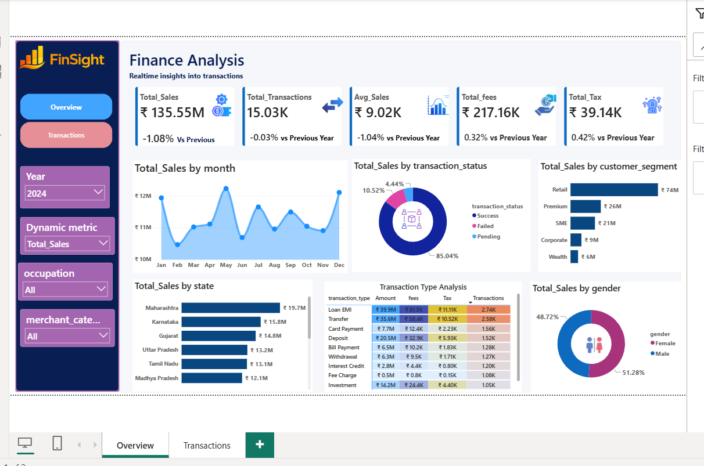
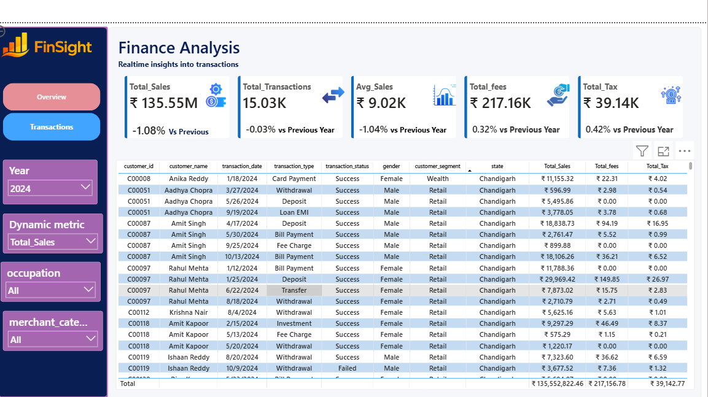

# Finance Analysis Dashboard – Power BI

## Project Overview

An interactive Finance Analysis Dashboard built using Microsoft Power BI
to analyze financial transactions and identify trends across different
business dimensions.

## Tools Used

- Power BI
- DAX
- Data Modeling
- Data Visualization

## Dashboard Features

- Total Sales
- Total Transactions
- Average Sales
- Total Fees
- Total Tax
- Monthly Sales Analysis
- Transaction Status Analysis
- Customer Segment Analysis
- State-wise Sales Analysis
- Transaction Type Analysis
- Gender Analysis
- Interactive Slicers
- Dynamic Metric Selection

## Key Learning

Through this project, I practiced:

- Creating interactive Power BI dashboards
- Creating measures using DAX
- Data modeling
- Using slicers and filters
- Selecting appropriate visualizations
- Presenting financial data through dashboards

## Project Screenshots

### Overview Dashboard

### Transactions Dashboard

